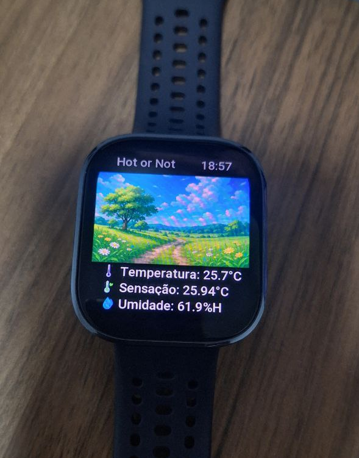

  

<h1 align="center">Hot or Not</h1>

  Real-time local temperature monitoring from Amazfit Bip 6.

---

## 📱 About the project

This is an app developed for the Amazfit Bip 6 that fetches temperature data from a middleware written in Go that in turn consumes an InfluxDB.

---

## 📸 Example

  

---

## 🛠 Tecnologias

- [Zepp OS SDK](https://docs.zepp.com/)
- JavaScript (Zepp OS API)
- Sensor DHT22
- Raspberry Pi (InfluxDB)
- GoLang Middleware
- Amazfit Bip 6

---

## ⚙️ How it works

- DHT22 connected to an esp32 that captures the temperature and the esp32 sends a request to InfluxDB running on a Raspberry Pi Zero 2W.
- A middleware written in Go fetches information from InfluxDB and exposes it in a simple way in an aggregator endpoint.
- An app made for the AmazFit Bip 6 consumes and displays data in real time.

  

